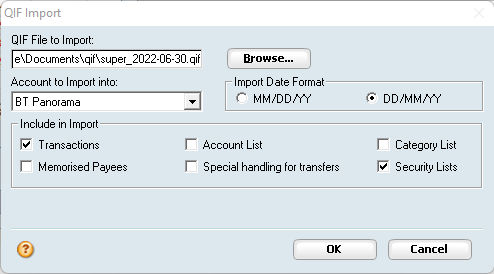

# BT2QIF
This tool will convert BT Panorama CSV files to QIF files so they can be imported into Reckon's Personal Plus application (or others that support QIF files). It will allow importing of the following information:
* Managed Funds (as Securities)
* Unit prices
* Transactions (cash income, expenses, deposits & payments, managed fund distributions, buys & sells)

## Prerequisites
The following prerequisites must be installed prior using this tool:
* Python (3.9 or above recommended)
* Git command line tools


## Getting started

To install the tool clone this GitHub repo:
```
git clone git@github.com:mantorok1/bt2qif.git
```

Install Python requirements:
```
pip3 install -r requirements.txt
```

This tool contains 3 folders:
* `config` - contains the `config.json` file
* `csv` - contains the CSV files to be converted.
* `qif` - contains any QIF files that are generated by the tool

There are sample files in each of these folders.

Optionally create the `config.json`. This file defines the mapping between BT Panorama's incomes, deposits, expenses & payments to Personal Plus's categories & account transfers. Six types of mapping are supported: `Interest`, `AdminFee`, `AdviceFee`, `OtherFee`, `Deposit`, `Withdrawal` (not all need to be defined).
It can also support multiple BT Panorama accounts one of which you can define as the default one (for when you don't explicity tell the tool which one to use). If you don't create this file then the imported cash transactions will not contain a category in Personal Plus.

Example:
```
{
  "default": "account1",
  "account1": {
    "Interest": "Investment:Account 1:Interest",
    "AdminFee": "Investment Expenses:Account 1:Administration Fee",
    "AdviceFee": "Investment Expenses:Account 1:Advice Fee",
    "OtherFee": "Investment Expenses:Account 1:Other Fee",
    "Deposit": "[Bank Account 1]",
    "Withdrawal": "[Bank Account 1]"
  },
  "account2": {
    "Interest": "Investment:Account 1:BT Panorama:Interest",
    "AdminFee": "Investment Expenses:Account 2:BT Panorama:Administration Fee",
    "AdviceFee": "Investment Expenses:Account 2:BT Panorama:Advice Fee",
    "OtherFee": "Investment Expenses:Account 2:BT Panorama:Other Fee",
    "Deposit": "[Bank Account 2]",
    "Withdrawal": "[Bank Account 2]"
  }
}
```
In the above `account1` will be used as the default mappings. For `account1` any interest transactions will be mapped to the `Investment:Account 1:Interest` category. Deposits will create a transfer transaction with the `Bank Account 1` account. Note the use of square brackets when defining a transfer.


## Using the tool

Firstly download the `transactionHistoryCsvReportV3.csv` & `portfolioValuationCsvReport.csv` files from the BT Panorama website (in the Reports section). Ensure you select the correct date range before downloading the files. When downloads are complete place the files into the `csv` folder.

From the command prompt run the tool as follows:
```
python3 main.py {account}
```
where `{account}` corresponds to the account in the `config.json` file. If not specified it will use either the default one (from the `config.json` file) or the first one. If you don't have the `config.json` file then you don't need to specify this.

When finished there should be a file created in the `qif` folder. You can now import this into Personal Plus. To do this select `File > Import > QIF File` in the menu. On the dialog select the QIF file and the account you want to import the transactions into.  Also ensure the following options are selected:
* Import Date Format: `DD/MM/YY`
* Include in Import: `Transactions` & `Security Lists`




## Known Limitations
* Importing the same QIF file twice will generate duplicate transactions. Securities and prices are not duplicated though.